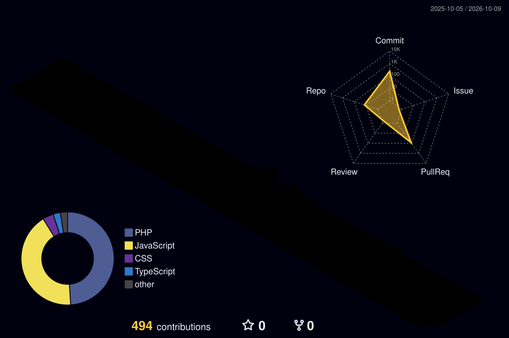

<!-- Header -->
<p align="center">
  
</p>

<p align="center">
  <a href="https://fablewave.digital">
    
  </a>
</p>

<p align="center">
  <a href="https://fablewave.digital"></a>
  <a href="https://fablewave.digital/ai-audit"></a>
  <a href="https://ayaan.fablewave.digital"></a>
  <a href="mailto:ayaankkh13@gmail.com"></a>
</p>

<p align="center">
  
</p>

---

### 👋 About me

I'm the **Founder & CEO of [FableWave Digital](https://fablewave.digital)**, an AI visibility agency that helps businesses show up when customers search on **Google, ChatGPT, Gemini and Perplexity**.

I don't just run the agency, I build the tech behind it: AI tools, e-commerce systems, web apps and the occasional game.

```ts
const ayaan = {
  role:     "Founder & CEO @ FableWave Digital",
  mission:  "Get businesses found on Google + AI search",
  building: ["AI tools", "E-commerce systems", "Web apps", "Games"],
  stack:    ["TypeScript", "Next.js", "Python", "WordPress"],
  location: "Pakistan · working with clients worldwide",
};
```

---

### 🚀 What I'm building

| | Venture | What it is |
|:-:|:--|:--|
| 🌊 | **[FableWave Digital](https://fablewave.digital)** | AI visibility agency: SEO, AEO and websites that AI recommends |
| 🔍 | **[AI Visibility Audit](https://fablewave.digital/ai-audit)** | Free tool that checks if AI names your business |
| 🛒 | **FableWave Commerce** | One central backend running multiple e-commerce stores |
| 🧸 | **[Tonymoni](https://tonymoni.com)** | E-commerce store built on Next.js + TypeScript |
| 🎮 | **[Plixoo](https://plixoo.fun)** | Browser game platform with avatars and an in-game marketplace |
| 🛡️ | **[Security Patch Plugin](https://github.com/ayaan-mb/Security-Patch-Plugin)** | Open-source WordPress security plugin |

---

### 🛠 Tech stack

<p align="center">
  
</p>

---

### 🏙️ My contributions in 3D

<p align="center">
  
</p>

<p align="center">
  
</p>

---

<p align="center">
  <b>Want your business to show up in AI answers?</b><br/>
  Start with a free audit at <a href="https://fablewave.digital/ai-audit">fablewave.digital/ai-audit</a>
</p>

<p align="center">
  
</p>
